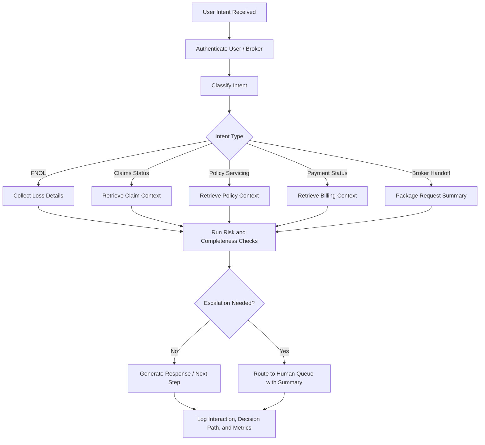

# P&C Insurance Agent Workflow

A product and implementation case study for an AI-enabled insurance service agent supporting **first notice of loss (FNOL), claims triage, policy servicing, payment status, and broker-carrier handoffs**.

This project translates insurance servicing pain points into structured agent requirements, workflow logic, escalation rules, human-in-the-loop controls, audit logging, prompt evaluation criteria, and adoption metrics.

## Problem

Insurance service teams often handle high-volume, repetitive requests across claims, policy servicing, payment status, and broker-carrier coordination. These workflows are frequently fragmented across intake channels, internal systems, manual routing rules, and compliance checks.

The goal is to design an AI agent workflow that improves service speed and consistency while preserving human oversight for regulated or high-risk decisions.

## Target Users

- Policyholders submitting FNOL or servicing requests
- Claims intake and triage teams
- Insurance brokers coordinating with carriers
- Customer service representatives handling policy and payment inquiries
- Supervisors reviewing escalations, exceptions, and audit logs

## Core Use Cases

| Use Case | Agent Responsibility | Human Escalation Trigger |
|---|---|---|
| FNOL intake | Capture incident details, validate policy context, classify loss type, collect missing information | Injury, fraud indicators, coverage uncertainty, incomplete identity verification |
| Claims triage | Route claim by severity, product line, documents, and urgency | High severity, disputed liability, complex coverage, legal involvement |
| Policy servicing | Answer policy questions, summarize coverage, support change requests | Coverage interpretation, endorsement approval, cancellation, regulatory disclosure |
| Payment status | Retrieve payment status, explain billing timeline, flag failed payments | Refund disputes, chargebacks, overdue policy risk, billing exception |
| Broker-carrier handoff | Package request context, summarize next action, route to correct team | Missing documents, conflicting instructions, priority broker request |

## Agent Workflow Design

## Requirements

### Functional Requirements

1. Detect and classify insurance intents across FNOL, claims, policy servicing, payment status, and broker-carrier handoffs.
2. Convert natural-language user requests into structured fields such as policy number, claim number, loss date, incident type, document status, billing status, and next action.
3. Ask follow-up questions when required information is missing.
4. Generate service summaries for customer service representatives and claims handlers.
5. Route high-risk, unclear, or regulated requests to a human reviewer.
6. Maintain an audit trail of user input, system response, escalation reason, and final resolution path.

### Non-Functional Requirements

- Response latency should support near-real-time customer service interactions.
- Escalation logic must be explainable to supervisors and QA reviewers.
- Agent outputs must avoid unsupported coverage determinations.
- Logs must support audit review, model monitoring, and complaint analysis.
- Workflow must be configurable by product line, state, policy type, and carrier rules.

## Human-in-the-Loop Controls

| Control Area | Design Decision |
|---|---|
| Coverage uncertainty | Agent summarizes context but routes final determination to licensed or authorized staff |
| Fraud / SIU indicators | Agent flags and escalates without accusing the customer |
| Legal / injury claims | Mandatory human review before claim guidance |
| Policy cancellation or endorsement | Agent collects data and creates service task; human approves final action |
| Low-confidence output | Agent requests clarification or escalates with confidence score and reason |
| Complaint risk | Agent routes sensitive interactions to supervisor queue |

## Audit Logging Design

Each interaction should capture:

- User intent and confidence score
- Extracted entities and missing fields
- Source systems queried
- Policy / claim / billing context used
- Prompt version and response version
- Escalation trigger and queue assignment
- Human override, if applicable
- Final resolution status
- SLA timestamps and handoff owner

## Prompt Evaluation Criteria

| Evaluation Dimension | Success Criteria |
|---|---|
| Intent accuracy | Correctly classifies FNOL, claim status, policy servicing, payment, or broker handoff |
| Completeness | Captures required fields before proceeding |
| Compliance safety | Avoids unauthorized coverage decisions or misleading claim guidance |
| Escalation quality | Escalates the right cases with clear reason codes |
| Response clarity | Provides plain-language next steps to customer or broker |
| Auditability | Produces structured logs that support QA and compliance review |

## Adoption Metrics

- FNOL containment rate
- Average handling time reduction
- Escalation precision and recall
- First-contact resolution rate
- Missing-information reduction
- Broker handoff turnaround time
- Customer satisfaction score
- QA pass rate
- Human override rate
- Complaint / rework rate

## Product Roadmap

### Phase 1: Discovery and Workflow Mapping

- Interview claims, service, broker operations, compliance, and QA teams.
- Map existing FNOL, claims triage, policy servicing, billing, and broker handoff workflows.
- Define success metrics and escalation categories.

### Phase 2: Agent Requirements and Prototype

- Build intent taxonomy and required-field logic.
- Define HITL rules and escalation paths.
- Create prompt evaluation checklist and test scenarios.

### Phase 3: Pilot Deployment

- Launch with limited use cases such as FNOL intake and payment status.
- Monitor containment, escalations, QA pass rate, and customer feedback.
- Tune prompts, rules, and workflow routing.

### Phase 4: Scale and Governance

- Expand to additional policy lines, broker workflows, and claims servicing scenarios.
- Add supervisor dashboards, audit reporting, and continuous evaluation.
- Establish governance for prompt versioning, incident review, and model-risk controls.

## Resume Positioning

**AI Insurance Workflow Product Design** — Designed a P&C insurance agent workflow covering FNOL, claims triage, policy servicing, payment status, and broker-carrier handoffs; defined agent requirements, escalation paths, HITL controls, audit logging, prompt evaluation criteria, and adoption metrics for insurance-grade service automation.

## Tools and Methods

- Product requirements
- User intent mapping
- Workflow automation design
- Human-in-the-loop governance
- Prompt evaluation
- Audit logging
- Insurance operations analysis
- Service quality metrics
